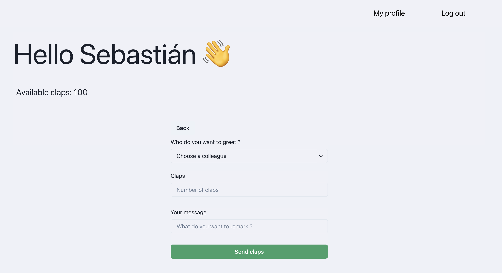
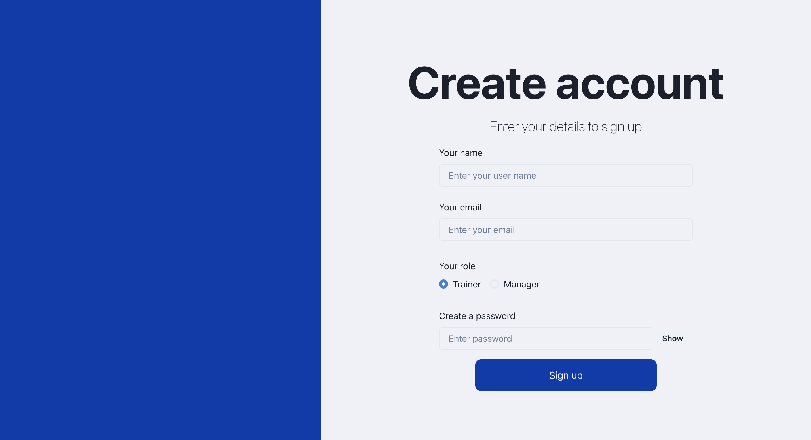
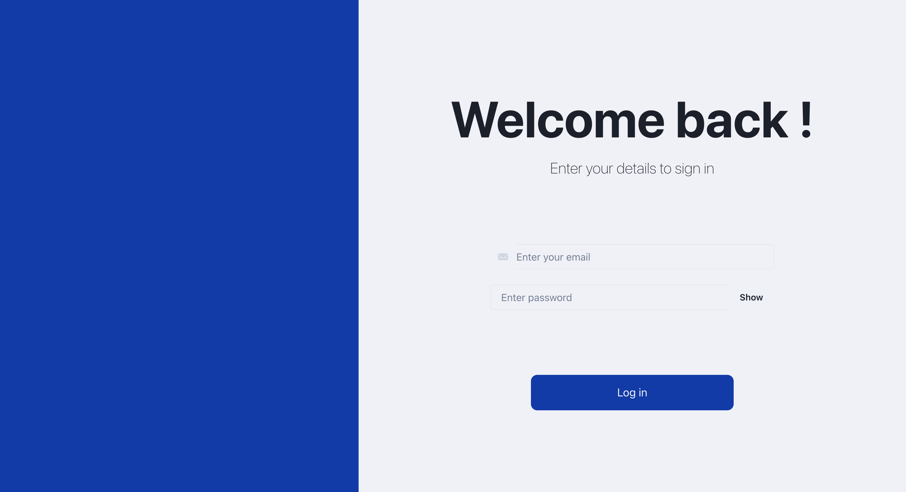

<h1 align="center" style="display: block; font-weight: 100 ; margin-block-start: 1em; margin-block-end: 1em;">
EgonApp
</h1>







## Introduction

Welcome to Egon, an innovative application designed to foster a culture of recognition and motivation within teams. Egon is inspired by the principles of peer recognition platforms like Nailted and is tailored to enhance workplace morale by allowing team members to commend each other.

By integrating Egon into your team's routine, you can help build a supportive environment that celebrates each member's contributions and fosters a strong sense of community. Get ready to clap and be clapped, and watch as motivation and workplace happiness soar!


#### <ins>Key Features of Egon</ins>:

🔹 <strong>Peer-to-Peer Recognition</strong>: Egon enables team members to give verbal awards to each other, encapsulating these commendations in the form of "claps". This allows colleagues to express appreciation for each other's efforts and achievements.

🔹 <strong>Weekly Notifications</strong>: Every Monday, team members receive notifications showcasing the claps they have received from their peers. This regular acknowledgment serves as a weekly morale booster and starts the week on a positive note.

🔹 <strong>Clap Budget</strong>: To ensures that claps are given thoughtfully and that they retain their significance as a form of recognition, each team member is allocated a limited number of claps to distribute each week.

🔹 <strong>Accumulative Recharge</strong>: Each week, team members' clap balances are replenished with an additional 100 claps. Unused claps from the previous week will carry over.

## Features tracker

- [x] Send and receive claps from colleagues. 
- [ ] Available claps are updated with every given clap.
- [ ] 100 clap points are given to any user on a weekly basis.
- [ ] Send an email to the user every time she receives recognition.
- [ ] The email is received on Monday's morning.
- [x] Create an account and log in to the application.


## 🚀 Getting started

### Client

To run the client, follow these steps:

Make sure you have all the necessary dependencies installed:

```shell
npm i
```

Run the command `npm run dev` to start the client.

The client should now be running and accessible at the specified port.
